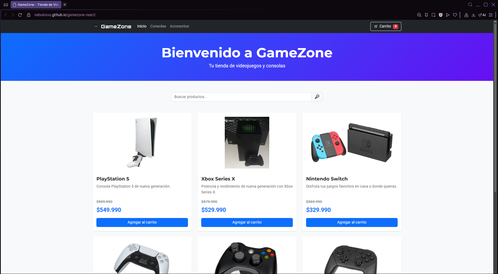
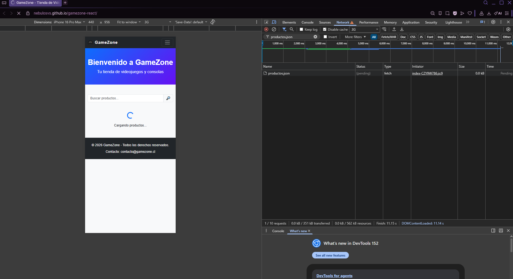
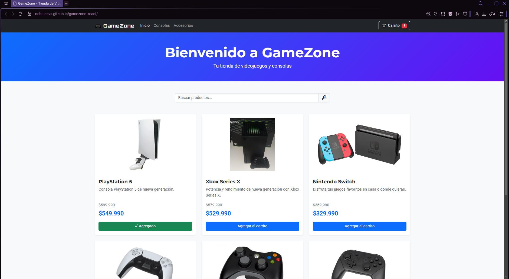
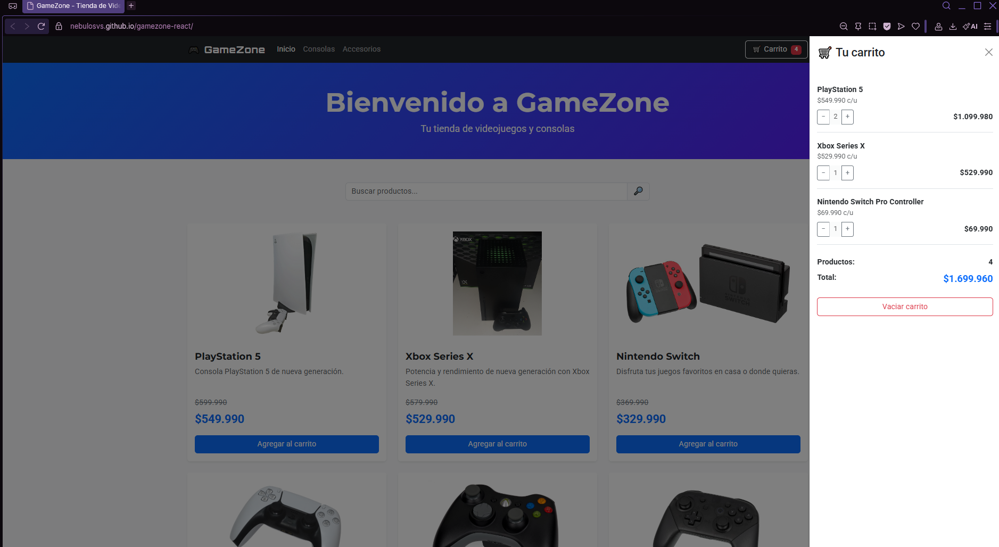
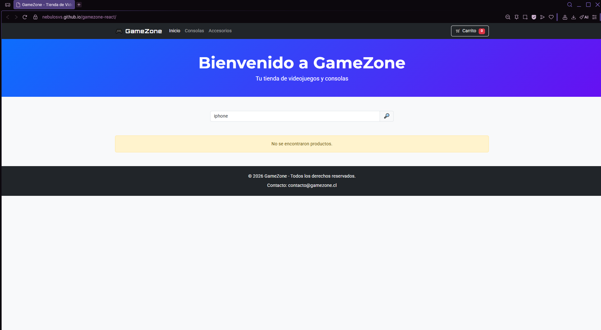

# 🎮 GameZone - eCommerce React

GameZone es una aplicación web de eCommerce enfocada en la venta de videojuegos, consolas y accesorios.

El proyecto fue desarrollado utilizando **React + Vite** y continúa la evolución de las versiones anteriores de GameZone, incorporando componentes funcionales, gestión de estados con `useState`, manejo de efectos secundarios con `useEffect`, carga dinámica de productos y renderizado condicional.

---

## 🌐 Sitio publicado

La aplicación se encuentra desplegada mediante GitHub Pages:

https://nebulosvs.github.io/gamezone-react/

---

## ✨ Funcionalidades

GameZone incluye las siguientes funcionalidades:

- Visualización dinámica del catálogo de productos.
- Carga de productos desde un archivo JSON local.
- Indicador visual mientras se cargan los productos.
- Manejo de errores durante la carga del catálogo.
- Filtrado de productos por categoría:
  - Inicio.
  - Consolas.
  - Accesorios.
- Búsqueda de productos por nombre o descripción.
- Carrito de compras interactivo.
- Agregar productos al carrito.
- Aumentar y disminuir la cantidad de cada producto.
- Eliminar productos del carrito.
- Vaciar completamente el carrito.
- Contador total de productos.
- Cálculo automático del precio total.
- Mensaje cuando el carrito se encuentra vacío.
- Mensaje cuando una búsqueda no encuentra productos.
- Confirmación visual temporal al agregar un producto.
- Diseño responsive para escritorio, tablet y dispositivos móviles.

---

## ⚛️ Implementación con React

La aplicación está construida mediante componentes funcionales de React.

Los principales componentes son:

- `Navbar`: navegación entre categorías y acceso al carrito.
- `SearchBar`: búsqueda dinámica de productos.
- `ProductList`: listado y renderizado de productos.
- `ProductCard`: representación individual de cada producto.
- `Cart`: administración de productos seleccionados.
- `Footer`: información inferior de la aplicación.

Esta organización permite separar responsabilidades y mantener el código modular y reutilizable.

---

## 🔄 Carga dinámica de productos

Los productos ya no se encuentran definidos directamente dentro de los componentes de React.

La información del catálogo se almacena en:

```text
public/data/productos.json
```

Al iniciar la aplicación, `App.jsx` utiliza `useEffect` junto con `fetch()` para cargar los productos dinámicamente.

El proceso general es:

```text
productos.json
      ↓
    fetch()
      ↓
  useEffect()
      ↓
 setProductos()
      ↓
   useState
      ↓
   Catálogo
```

Una vez obtenidos los datos del archivo JSON, el estado del catálogo se actualiza mediante `setProductos()` y React vuelve a renderizar la interfaz con los productos disponibles.

---

## 🧠 Gestión de estados con useState

La aplicación utiliza el Hook `useState` para gestionar diferentes estados.

En `App.jsx` se administran:

- Lista de productos.
- Productos agregados al carrito.
- Categoría seleccionada.
- Texto ingresado en el buscador.
- Estado de carga del catálogo.
- Estado de error durante la carga.

Además, `ProductCard` utiliza un estado interno para mostrar una confirmación temporal cuando un producto es agregado al carrito.

Por ejemplo:

```jsx
const [agregado, setAgregado] = useState(false);
```

Esto permite modificar dinámicamente la interfaz según las acciones realizadas por el usuario.

---

## ⚙️ Manejo de efectos con useEffect

La aplicación utiliza `useEffect` para manejar efectos secundarios.

### Carga inicial del catálogo

Al cargar la aplicación se realiza una petición al archivo:

```text
public/data/productos.json
```

Los datos obtenidos son almacenados posteriormente en el estado `productos`.

La carga se ejecuta una vez cuando se monta el componente principal.

### Confirmación temporal del carrito

`ProductCard` también utiliza `useEffect` para controlar el mensaje temporal mostrado después de agregar un producto.

Al presionar:

```text
Agregar al carrito
```

el botón cambia temporalmente a:

```text
✓ Agregado
```

Después de aproximadamente dos segundos vuelve automáticamente a su estado original.

El temporizador utiliza una función de limpieza con `clearTimeout()` para evitar efectos secundarios innecesarios.

---

## 🔀 Renderizado condicional

GameZone utiliza renderizado condicional en diferentes partes de la aplicación para mejorar la experiencia del usuario.

### Carga de productos

Mientras los productos están siendo obtenidos desde el archivo JSON se muestra:

```text
Cargando productos...
```

### Error de carga

Si ocurre un problema durante la carga del catálogo, se muestra un mensaje de error.

### Búsqueda sin resultados

Cuando ningún producto coincide con los filtros o con el texto ingresado:

```text
No se encontraron productos.
```

### Carrito vacío

Cuando todavía no existen productos agregados:

```text
Tu carrito está vacío.
```

### Producto agregado

Al agregar un producto, el botón cambia temporalmente:

```text
Agregar al carrito
```

por:

```text
✓ Agregado
```

y también modifica su estilo visual.

---

## 🛒 Carrito de compras

El carrito permite administrar los productos seleccionados por el usuario.

Cada producto posee una propiedad `cantidad`.

Si se agrega nuevamente un producto existente, su cantidad aumenta en lugar de crear un elemento duplicado.

Desde el carrito es posible:

- Incrementar la cantidad con `+`.
- Disminuir la cantidad con `-`.
- Eliminar un producto al disminuir su última unidad.
- Vaciar completamente el carrito.

La aplicación calcula automáticamente:

- Cantidad total de productos.
- Subtotal de cada producto.
- Precio total de la compra.

---

## 🔎 Búsqueda y categorías

Los productos pueden filtrarse mediante dos mecanismos.

### Categorías

La barra de navegación permite seleccionar:

```text
Inicio
Consolas
Accesorios
```

### Buscador

El buscador utiliza un input controlado mediante React.

El evento `onChange` actualiza el estado de búsqueda y permite encontrar coincidencias tanto en el nombre como en la descripción del producto.

---

## 🧩 Reutilización de código

Las funciones reutilizables se encuentran separadas de los componentes cuando corresponde.

El archivo:

```text
src/utils/formatters.js
```

contiene la función:

```javascript
formatearPrecio()
```

Esta función es utilizada tanto por `ProductCard` como por `Cart`, evitando duplicar la lógica encargada de mostrar valores monetarios en pesos chilenos.

---

## 📁 Estructura del proyecto

```text
gamezone-react/
│
├── public/
│   ├── data/
│   │   └── productos.json
│   │
│   └── img/
│       ├── playstation5.jpg
│       ├── xbox-series-x.jpg
│       ├── nintendo-switch.jpg
│       ├── dualsense.png
│       ├── xbox-controller.jpg
│       └── switch-pro-controller.jpg
│
├── src/
│   ├── components/
│   │   ├── Cart.jsx
│   │   ├── Footer.jsx
│   │   ├── Navbar.jsx
│   │   ├── ProductCard.jsx
│   │   ├── ProductList.jsx
│   │   └── SearchBar.jsx
│   │
│   ├── utils/
│   │   └── formatters.js
│   │
│   ├── App.css
│   ├── App.jsx
│   ├── index.css
│   └── main.jsx
│
├── index.html
├── package.json
├── package-lock.json
├── vite.config.js
└── README.md
```

---

## 🛠️ Tecnologías utilizadas

- HTML5
- CSS3
- JavaScript
- React
- React Hooks
  - `useState`
  - `useEffect`
- Vite
- Bootstrap 5
- JSON
- Git
- GitHub
- GitHub Pages

---

## ▶️ Instalación y ejecución

Para ejecutar el proyecto localmente:

### 1. Clonar el repositorio

```bash
git clone https://github.com/nebulosvs/gamezone-react.git
```

### 2. Ingresar al proyecto

```bash
cd gamezone-react
```

### 3. Instalar las dependencias

```bash
npm install
```

### 4. Ejecutar el servidor de desarrollo

```bash
npm run dev
```

Vite mostrará en la terminal la dirección local donde se encuentra disponible la aplicación.

---

## 🏗️ Generar versión de producción

Para comprobar y generar la versión optimizada:

```bash
npm run build
```

Los archivos generados serán almacenados en:

```text
dist/
```

---

## 🚀 Despliegue con GitHub Pages

El proyecto utiliza la rama `gh-pages` para publicar la aplicación.

La configuración de Vite utiliza:

```javascript
base: "/gamezone-react/"
```

Para realizar el despliegue:

```bash
npm run deploy
```

El script genera la versión de producción y publica el contenido correspondiente mediante GitHub Pages.

---

## 📱 Diseño responsive

GameZone utiliza Bootstrap y estilos CSS personalizados para adaptarse a diferentes tamaños de pantalla.

La aplicación puede utilizarse desde:

- Computadores de escritorio.
- Tablets.
- Dispositivos móviles.

El catálogo modifica automáticamente la cantidad de columnas según el espacio disponible.

---

## 📸 Evidencias

### 1. Catálogo cargado dinámicamente

Los productos son cargados desde `public/data/productos.json` mediante `fetch` y `useEffect`.



### 2. Estado de carga

Mientras se obtienen los datos se muestra un indicador de carga mediante renderizado condicional.



### 3. Renderizado condicional

Al agregar un producto, el botón cambia temporalmente a `✓ Agregado`, proporcionando retroalimentación visual al usuario.



### 4. Carrito de compras

El carrito permite administrar cantidades, eliminar productos y calcular automáticamente el total de la compra.



### 5. Búsqueda sin resultados

Cuando ningún producto coincide con la búsqueda se muestra un mensaje mediante renderizado condicional.



---

## 👩‍💻 Autor

Sofía Medina.
Proyecto desarrollado para la asignatura **Desarrollo Frontend I (PFY2201)**.

---

## 📄 Licencia

Proyecto desarrollado con fines académicos.